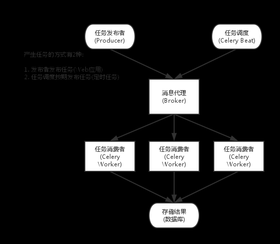
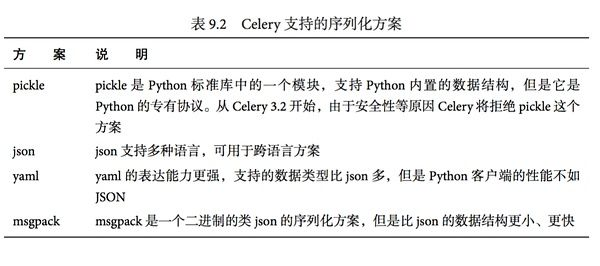

# Celery 学习
- 内容出处 [知乎:python 之美](https://zhuanlan.zhihu.com/p/22304455)

### celery 组件

- celery Beat:
> 任务任务调度器，Beat进程会读取配置文件的内容，周期性地将配置中到期需要执行的任务发送给任务队列。

- Celery Worker:
>  执行任务的消费者，通常会在多台服务器运行多个消费者来提高执行效率。

- Broker:

> 消息代理，或者叫作消息中间件，接受任务生产者发送过来的任务消息，存进队列再按序分发给任务消费方（通常是消息队列或者数据库）。

- Producer:

> 调用了Celery提供的API、函数或者装饰器而产生任务并交给任务队列处理的都是任务生产者。

- Result Backend

> 任务处理完后保存状态信息和结果，以供查询。Celery默认已支持Redis、RabbitMQ、MongoDB、Django ORM、SQLAlchemy等方式。

### Celery 架构图:



### Celery 序列化


### 安装

```python
pip install "celery[librabbitmq,redis,msgpack]"
```
`bundles的原理是在setup.py的setup函数中添加extras_require。`

### 启动:
```shell
celery -A Celery worker -l info
```
- 注意要在此项目外运行.

- celery 版本 4 以上

```shell
celery -A your_app_name worker --pool=solo -l info
```


