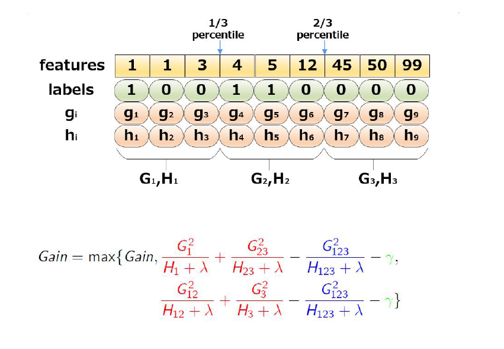

# 1. XGBoost算法的策略与计算模式

## 1.1 XGBoost 的原理

### 1.1.1 定义

> XGBoost 是使用梯度提升框架实现了高效, 灵活, 可移植的机器学习库, 全称是 eXtreme Gradient Boosting, 是 GBDT(GBM)的一个 C++ 实现, 它将树的生成并行完成, 从而提高学习速度.

## 1.2  算法实现

### 1.2.1 泰勒公式

- 定义:

  泰勒公式是一个用函数在某点的信息描述其附近取值的公式.$\color{red}{局部有效性}$

- 基本形式
  $$
  f(x) = \sum_{n=0}^{\infty}\frac{f^{(n)}(x_0)}{n!}(x - x_0)^n
  $$

  - 一阶泰勒展开: $f(x) \approx f(x_0) + y^{\\'}(x_0)(x-x_0) $
  - 二阶泰勒展开: $f(x) \approx f(x_0) + y^{\\'}(x_0)(x-x_0) + f^"(x_0)\frac{(x - x_0)^2}{2}$

- 迭代形式

  假设 $x^t = x^{t-1} + \Delta \ x$ , 将 $f(x^t)$ 在 $x^{t-1}$处进行泰勒展开
  $$
  \begin{align}
  f(x^t) & = f(x^{t-1} + \Delta x) \\
  & \approx f(x^{t-1}) + f^{'}(x^{t-1})\Delta x + f^"(x^{t-1})\frac{\Delta x^2}{2}
  \end{align}
  $$
  

### 1.2.2 梯度下降法(Gradient Descend Method)

- 定义

  在机器学习任务中, 需要最小化损失函数 $L(\theta)$, 其中 $\theta$ 是要求解的模型参数. 

  梯度下降常用来求解这种**无约束最优化问题**, 它是一种迭代方法: 选取初值 $\theta^0$, 不断迭代, 更新 $\theta$ 的值, 进行损失函数的极小化.

- 迭代公式: $\theta^t = \theta^{t-1} + \Delta \theta$

- 将 $L(\theta^t)$ 在 $\theta^{t-1}$ 处进行一阶泰勒展开:
  $$
  \begin{align}
  L(\theta^t) &= L(\theta^{t-1} + \Delta\theta)\\
  & \approx L(\theta^{t-1}) + L^{'}(\theta^{t-1})\Delta\theta
  \end{align}
  $$

- 要使得 $L(\theta^t) < L(\theta^{t-1})$,  可取: $\Delta\theta = -\alpha L^{'}(\theta^{t-1})$, 则: $\theta^t = \theta^{t-1} - \alpha L^{'}(\theta^{t-1})$

  这里 $\alpha$ 是步长,  可以通过 line search(线搜索: 找到局部最小值) 确定, 但一般直接赋一个**小**的数.

### 1.2.3 牛顿法 (Newton's Method)

- 将 $L(\theta^t)$ 在 $\theta^{t-1}$处进行二阶泰勒展开:
  $$
  L(\theta^t) \approx L(\theta^{t-1} + L^{'}(\theta^{t-1})\Delta\theta + L^"(\theta^{t-1})\frac{\Delta\theta^2}{2}
  $$
  为了简化分析过程, 假设参数是标量(即 $\theta$ 只有唯一值), 则可将一阶和二阶导数分别记为 g 和 h:
  $$
  L(\theta^t) \approx L(\theta^{t-1}) + g\Delta\theta + h\frac{\Delta\theta^2}{2}
  $$
   要使得$L(\theta^t)$极小,即让 $g\Delta\theta + h\frac{\Delta\theta^2}{2}$ 极小, 可令: 
  $$
  \frac{\partial(g\Delta\theta + h\frac{\Delta\theta^2}{2})}{\partial\Delta\theta} = 0
  $$
  求得:
  $$
  \Delta\theta = -\frac{g}{h}
  $$
  
  故:
  $$
    \theta^t = \theta^{t-1} + \Delta\theta = \theta^{t-1} - \frac{g}{h}
  $$
  参数 $\theta$ 推广到向量形式, 迭代公式:  $\theta^t = \theta^{t-1} - H^{-1}g$
  
  这里 $H$ 是海森矩阵.

### 1.2.4 从参数空间到函数空间

- GBDT 在函数空间中利用梯度下降法进行优化
- XGBoost 在函数空间中用牛顿法进行优化

实际上GBDT 泛指所有梯度提升树算法, 包括 XGBoost, 它也是 GBDT 的 一种变种, 这里为了区分它们, GBDT 特指 "Greedy Function Approximation: A Gradient Boosting Machine "里提出的算法, 它只用了一阶导数信息.

### 1.2.5 小结

- Boosting 算法是一种加法模型(additive training)
  $$
  F(x) = \sum_{t=0}^T f_t(x)
  $$

- 基分类器 $f$ 常采用回归树 和 逻辑回归.

- 树模型的优缺点:

  - 优点
    - 可解释强
    - 可处理混合类型特征
    - 具体伸缩不变性(不用归一化特征)
    - 有特征组合的作用
    - 可自然地处理缺失值
    - 对异常点鲁棒(robustness)
    - 有特征选择作用
    - 可扩展性强, 容易并行
  - 缺点
    - 缺乏平滑性(回归预测时输出值只能输出有限的若干树种类)
    - 不适合处理高纬度稀疏数据.

## 1.3 Gradient Boosting Tree 算法原理

### 1.3.1 提升的概念

- 提升是一个机器学习技术, 可以用于回归和分类问题, 它每一步产生一个弱预测模型(如决策树), 并加权到总模型中; 如果每一步的弱预测模型生成都是依据损失函数的梯度方向, 则称为梯度提升(**Gradient Boosting**)
- 梯度提升算法首先给定一个目标损失函数, 它的定义域是所有可行的弱函数集合(基函数); 提升算法 通过迭代的选择一个负梯度方向上的基函数来逐渐逼近局部极小值. 这种在函数域的梯度提升观点对 机器学习有很多领域有深刻影响.
- 提升的理论意义: 如果一个问题存在一个弱分类区, 则可以通过提升的办法得到强分类器.

### 1.3.2 模型以及损失函数

- 其模型 F 定义为 加法模型:
  $$
  F(x; w) = \sum_{t=0}^T\alpha_th_t(x;w_t) = \sum_{t=0}^Tf_t(x;w_t)
  $$
  其中,  x 为输入样本, h为分类回归树, w 是分类回归树的参数, $\alpha$是每棵树的权重.

- 通过最小化损失函数求解最优模型:
  $$
  F^* = argmin\sum_{i=0}^NL(y_i, F(x_i;w))
  $$

- 通贪心算法, 迭代求局部最优解

  以贪心的思路拓展得到 $F_m(x)$
  $$
  
  $$
  

### 1.3.3 算法实现

​	输入: $(x_i, y_i), T, L$

1.  初始化$f_0$

2.  for t = 1 to T  do

   1.  计算响应: 
      $$
      \hat{y_i} = - [\frac{\partial{L(y_i, F(x_i))}}{\partial{F(x_i)}}]_{F(x)=F_{t-1}(x)}, i=1, 2, ...,N
      $$
   
2. 学习第t棵树:
      $$
      w^* = argmin\sum_{i=1}^N(\hat{y_t}-h_t(x_i;w))^2
      $$
   
3.  line search 找步长:   
    $$
      \rho ^* = arg min\sum_{i=1}^N L(y_i, F_{t-1}(x_i) + \rho h_t(x_i;w^*))
    $$
   
4. 令 $f_t = \rho^*h_t(x;w^*)$
   
   更新模型: $F_t = F_{t-1} + f_t$
   
3. 输出 $F_T$

## 1.4 XGBoost 算法原理

### 1.4.1 模型函数形式

给定数据集 $D = {(X_i, y_i)}$,  XGBoost 进行 additive trainging , 学习 K 棵树, 采用以下函数对样本进行预测:
$$
\hat{y_i} = \phi(X_i) = \sum_{k=1}^k f_k(X_i),  f_k \in F
$$

这里 F 是假设空间, $f(x)$ 是回归树 (CART):
$$
F= {f(X) = w_{q(x)}}(q: R^m \rightarrow T, w \in R^T)
$$
q(x) 表示将样本 x 分到了 某个叶子节点上,  w 是叶子节点的分数 (leaf score), 所以 $w_{q(x)}$ 表示你回归树对样本的预测值.

> 回归树的预测输出的分数, 可用于回归,分类, 排序等任务中. 对于回归问题, 可以直接作为目标值, 对于分类问题, 需要映射成概率, 比如采用逻辑函数 $\sigma(z) = \frac{1}{1+e^{-z}}$

### 1.4.2 目标函数

-  参数空间中的目标函数:
  $$
  Obj(\theta) = L(\theta) + \Omega(\theta)
  $$

  - $L(\theta)$ 误差函数: 我们的模型有多拟合数据.
  - $\Omega(\theta)$ 正则化项: 惩罚复杂模型

  误差函数可以试 square loss, logloss 等, 正则项可以试 L1正则, L2正则等.

  Ridge Regression (岭回归):
  $$
  \sum_{i=1}^n(y_i-\theta^tx_i)^2 + \lambda||\theta||^2
  $$
  LASSO:
  $$
  \sum^{n}_{i=1}(y_i - \theta^Tx_i)^2 + \lambda||\theta||
  $$
  
###   1.4.3 正则项

- 正则项的作用

  - 通过偏差方差分解去解释
  - PAC-Learning 泛化界解释
  - Bayes 先验解释, 把正则当成先验

- 从Bayes 角度来看, 正则相当于对模型参数引入先验分布:

  

- XGBoost 的目标函数(函数空间)
  $$
  L(\phi) = \sum_il(\hat{y_i}, y_i) + \sum_k\Omega(f_k)
  $$
  正则项对每棵回归树的复杂度进行了惩罚

- 相比原始的GBDT, XGBoost的目标函数多了正则项, 使得学习出来的模型更加不容易过拟合

- 有哪些指标可以衡量树的复杂度?

  树的深度, 内部节点个数, 叶子节点个数(T), 叶节点分数(w) .....

  XGBoost 采用的:
  $$
  \Omega(f) = \gamma T + \frac{1}{2}\lambda||w||^2
  $$
  对叶子节点个数进行惩罚, 相当于在训练过程中做了剪纸.

### 1.4.4 误差函数的二项泰勒展开

- 第t次迭代后, 模型的预测等于前 t - 1 次的模型预测加上第 t 棵树的预测:
  $$
  \hat{y_i}^{(t)} = \hat{y_i}^{t-1} + f_t(x_i)
  $$

- 此时目标函数可以写作:
  $$
  L^{(t)} = \sum_{i=1}^nl(y_i, \hat{y_i}^{(t-1)} + f_t(X_i)) + \Omega(f_t)
  $$
  公式中 $y_i, \hat{y}_i^{t-1}都已知, 模型要学习的只有第t棵树 $$f_t$

- 将误差函数在 $\hat{y_i}^{t-1}$ 出进行二项泰勒展开
  $$
  L^{(t)} \approx \sum_{i=1}^n[l(y_i, \hat{y}^{(t-1)}) + g_if_t(X_i) +\frac{1}{2}h_if_t^2(X_i)] +\Omega(f_t)
  $$
  公式中:
  $$
  g_i = \frac{\partial l(y_i, \hat{y}^{(t-1)})}{\partial{\hat{y}^{(t-1)}}} \\
  h_i = \frac{\partial^2 l(y_i, \hat{y}^{(t-1)})}{\partial{\hat{y}^{(t-1)}}}
  $$

- 将公式中的常数项去掉, 得到:
  $$
  \widetilde{L}^{(t)} = \sum_{i=1}^n[g_if_t(X_i) + \frac{1}{2}h_if_t^2(X_i)] + \Omega(f_t)
  $$

- 把$f_t, \Omega(f_t)$写成树结构的形式, 即把下式代入目标函数中
  $$
  f(X) = w_{q(x)} \\
  \Omega(f) = \gamma T + \frac{1}{2}\lambda||w||^2
  $$
  得到:
  $$
  \begin{align}
  \widetilde{L}^{(t)} &= \sum_{i=1}^n[g_if_t(x_i) + \frac{1}{2}h_if_t^2(x_i)] + \Omega(f_t) \\
  &= \sum_{i=1}^n[g_i\color{red}{w_{q{x_i}}} \color{black} + \frac{1}{2}h_i \color{red}w^2_{q(x_i)} \color{black} ] + \color{red} \gamma T + \lambda \frac{1}{2}\sum_{j=1}^Tw_j^2
  \end{align}
  $$
  问题: 

  $\sum^n_{i=1}$ 是样本累加,  $\lambda\frac{1}{2}\sum_{j=1}^Tw_j^2$ 对叶节点累加. 如何统一起来?

- 怎么统一起来?

  定义每个叶节点 j 上的 样本集合为:  $I_j = {i|q(x_i) = j}$

  $I_j$返回的是 叶子的编号,  通过$q(x_i)$ 将样本数据集转换成: 叶子编号+权重.

  则目标函数可以写成按叶节点累加的形式:
  $$
  \begin{align}
  \widetilde{L}^{(t)} &= \sum_{j=1}^T[(\sum_{i\in I_j}g_i)w_j + \frac{1}{2}(\sum_{i\in I_j}h_i + \lambda)w^2_j] + \gamma T \\
  &= \sum_{j=1}^T[G_jw_j+\frac{1}{2}(H_j + \lambda)w_j^2] + \gamma T
  \end{align}
  $$

- 如果确定了树的结构(即$q(x)$确定), 为了使目标函数最小, 可以令其导数为0, 解得每个叶节点的最优预测分数为:
  $$
  w^*_j = - \frac{G_j}{H_j+\lambda}
  $$
  代入目标函数, 得到最下损失为:
  $$
  \widetilde{L}^* = - \frac{1}{2}\sum_{j=1}^T\frac{G_j^2}{H_j +\lambda} + \gamma T
  $$

### 1.4.5 回归树的学习策略

- 暴力枚举所有可能的树结构, 选择损失值最小的  ---NP难问题.

  贪心法, 每次尝试分裂一个叶节点, 计算分裂前后的增益, 选择增益最大的.

- 分裂前后的增益怎么计算?

  - ID3算法采用信息增益
  - C4.5 算法采用信息增益比
  - CART 采用 Gini 系数.

### 1.4.6 XGBoost 的打分函数

$$
\widetilde{L}^* = - \frac{1}{2}\sum_{j=1}^T \color{red}{ \frac{G_j^2}{H_j +\lambda}} \color{black} + \gamma T
$$

标红部分衡量了每个叶子节点对总体损失的贡献, 我们希望损失越小越好, 则标红的值越大越好.

因此, 对一个叶子节点进行分裂, 分裂前后的增益定义为:

$$
Gain = \frac{G_L^2}{H_L+\lambda} + \frac{G_R^2}{H_R+\lambda} - \frac{(G_L+G_R)^2}{H_L+H_R+\lambda} - \gamma
$$
Gain 的值越大, 分裂后L减少越多. 所以当对一个叶节点分割时, 计算所有候选(feature, value)对应的gain, 选取gain 最大的进行分割.

### 1.4.7 树节点分裂方法(Split Finding)

- 精确算法

  遍历所有特征的所有可能的分割点, 计算gain值, 选取值最大的(feature, value) 去分割

  

- 近似算法

  对于每个特征, 只考察分位点, 减小计算复杂度

  - Global: 学习每棵树前, 提出候选切分点
  - Local: 每次分裂前, 重新提出候切分点

  

- 近似计算法举例:  三分位数

  

- 实际上XGBoost 不是简答地按照样本个数进行定位, 而是以二阶导数值作为权重(Weighted Quantile Sketch), 比如:

  

- 为什么用hi 加权?

  把目标函数整理成一下形式, 可以看出hi有对loss加权的作用
  $$
  \sum_{i=1}^n\frac{1}{2}h_i(f_t(X_i) - \frac{g_i}{h_i})^2 + \Omega(f_t) + constant
  $$

### 1.4.8  稀疏值处理

- 稀疏值:

  缺失,  类别one-hot 编码, 大量0值

- 当特征出现缺失值时, XGBoost可以学习出默认的节点分裂方向

  

# 2. XGBoost的其他特性

- 行抽样(row sampje)

- 列抽样(column sample)

  借鉴随机森林

- Shrinkage (缩减),  即学习速率

  将学习速率调小, 迭代次数增多, 有正则化作用

- 支持自定义损失函数 (需要二阶可导)

# 3. XGBoost的系统设计

## 3.1 Column Block

- 特征预排序, 以column block 的结构存于内存中

- 存储样本索引(instance indices)

- block 中数据以稀疏格式(CSC) 存储

  

这个结构加速了 split finding 的过程, 只需要在建树前排序一次, 后面节点分裂时 直接根据索引得到梯度信息.

## 3.2 Cache Aware Access

- column block 按特征大小顺序存储, 相应的样本的梯度信息是分散的, 造成内存的不连续访问, 降低CPU cache 命中率

- 缓存优化法

  - 预取数据到 buffer 中 (非连续 ---> 连续), 在统计梯度信息
  - 调节块的大小

  

# 4. 更高效的工具包 LightGBM

- 速度更快
- 内存占用更低
- 准确率更高(优势不明显, 与XGBoost 相当)

