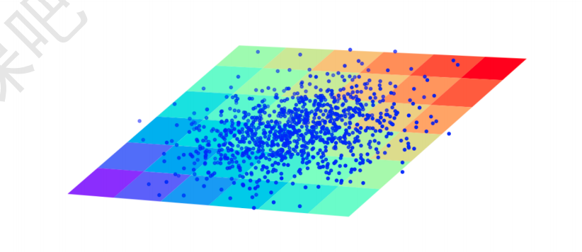

## 模型概念
我们可以将模型理解为一个函数(**一种映射规则**).
由训练数据来确认函数的参数，当参数确定好之后，我们就可以利用该模型(函数)对未知的数据(非训练时使用的数据)进行求值，也就是进行预测。输入模型的数据，我们称为训练数据。通过不断的进行训练，最终得到一个合适的模型，从而可以对未知的数据进行预测。而这个过程， 是与我们人类学习的过程是相似的。只不过人的认知与判断是通过经验得到的，而机器的认知与判断是通过数据得到的。

我们使用样本数据训练模型，数据中的每个属性， 我们称为**特征**。每条数据的目标输出值， 我们称为 **标签(监督学习)**。 
特征习惯使用 $x$ 表示，标签习惯使用 $y$ 表示. 这与函数的定义 $y = f(x)$ 相符。
### 回归分析
> **回归分析**是用来评估变量之间关系的统计过程。 用来解释自变量 $X$ 与自变量$Y$ 的关系。 即当自变量$X$ 发生改变时，因变量$Y$ 会如何发生改变.

#### 线性回归
线性回顾，是回归分析的一种，评估的自变量$X$与因变量$Y$之间是一种线性关系。当只有一个自变量时，称为 **简单线性回归**，当具有多个自变量时，称为**多元线性回归**
- 线性关系的理解:
  - 画出来的图像是直的.
  - 每个自变量最高次项为1.

#### 拟合
**拟合**， 是构建一种算法(数学函数)， 使得该算法能够符合真实的数据。从机器学习角度讲， 线性回归就是要构建一个线性函数，使得该函数与目标值之间的相符性最好。从空间的角度来看，就是要让函数的直线（面）, 尽可能靠近空间中所有的数据点(**点到直线的垂直距离最短**)。线性回归会输出一个连续值。
### 线性回归模型
#### 简单的线性回归
以房屋面积($x$) 与房屋价格($y$) 为例，显而易见， 二者是一种线性关系， 房屋价格与房屋面积，我们假设比例为 $w$
$$
 \hat{y} = w * x
$$
然而, 这种线性方程一定是过原点的，即当 $x$ 为 0时，y 也一定为0。这可能并不符合现实中某些场景，为了能够让方程具有更广泛的适用性， 我们这里再增加一个截距, 设为$b$, 即之前的方程变为:
$$
\hat{y} = w * x + b
$$
**线性回归是用来解释自变量与因变量之间的关系， 但是，这种关系并非严格的函数映射关系.**
#### 多元线性回归
$$
\hat{y} = w_1 * x_1 + w_2 * x_2 + w_3 * x_3 + ... + w_n * x_n  + b
$$
其中，每个$x$为影响因素, 每个 $w$ 为对应的影响力度， $y$ 为房屋的价格。

也可以用向量的表示方式,设 $\vec{x}$ 与 $\vec{w}$ 为两个向量:
 $$
 \vec{w} = (w_1, w_2, w_3, ..., w_n)^T
 $$
 $$
 \vec{x} = (x_1, x_2, x_3, ..., x_n)^T
 $$
 则方程可表示为:
 $$
 \begin{eqnarray*}
 \hat{y} &=& \sum_{j=1}^n w_j * x_j + b \\
     		&=& \vec{w}^T * \vec{x} + b
 \end{eqnarray*}
 $$
 我们可以进一步化简为:
 $$
 \begin{cases} 
 	x_0 =1 \\
    w_0 = b
 \end{cases}
 $$
 这样，就可以表示为:
 $$
 \begin{eqnarray*}
 \hat{y} &=& w_0 * x_0 + w_1 * x_1 +w_2 * x_2 +  w_3 * x_3 + ... + w_n * x_n \\
 &=& \sum_{j=0}^n w_j* x_j \\
 &=& \vec{w}^T * \vec{x}
  \end{eqnarray*}
 $$
 多元线性回归在空间中，可以表示为一个超平面，去拟合空间中的数据点。

### 损失函数与参数求解
#### 损失函数
> **损失函数**，也称 **目标函数**或者**代价函数**: 就是用来衡量模型预测值和真实值之间的差异。 机器学习的目标， 就是要建立一个损失函数，使得该函数的值最小。

也就是说，损失函数是一个模型参数的函数，自变量可能是取值组合通常是无限的，我们的目标，就是要在众多的组合中， 找到一组最合适的自变量组合(值)， 使得损失函数的值最小。

损失函数我们习惯用$J$来表示，例如， $J(w)$ 则表示为自变量的函数。在线性回归中，我们使用平方损失函数(最小二乘法)，
$$
\begin{eqnarray*}
J(w) &=& \frac{1}{2}\sum_{j=i}^m(y^{(i)} - \hat{y})^2 \\
&=& \frac{1}{2}\sum_{i=1}^m(y^{(i)} - \vec{w}^T\vec{x}^{(i)})^2
\end{eqnarray*}
$$
### 参数求解
关于参数求解，可以使用损失函数求导， 令倒函数为0的方式来求解最小值。
### 回归模型评估
- MSE
- RMSE
- MAE
- $R^2$
#### MSE
MES(Mean Squared Error)，平均平方误差，为所有样本数据误差(真实值与预测值之差)的平方和，然后取均值
$$
	MSE = \frac{1}{m}\sum_{i=1}^m(y^{(i)} - \hat{y}^{(i)})^2
$$
#### RMSE
RMSE (Root Mean Squared Error), 平均平方误差的平方根， 即在MSE的基础上，取平方跟。
$$
 RMSE = \sqrt{MSE} = \sqrt{ \frac{1}{m}\sum_{i=1}^m(y^{(i)} - \hat{y}^{(i)})^2}
$$
#### MAE
MAE (Mean Absolute Error), 平均绝对误差，为所有样本数据误差的绝对值和。
$$
	MAE = \frac{1}{m}\sum_{i=1}^m |y^{(i)} - \hat{y}^{(i)}|
$$
### $R^2$
$R^2$ 为决定系数，用来表示模型拟合的分值， 值越高表示模型拟合型越好， 在训练集中，$R^2$的取值范围为$[0, 1]$.在测试集(未知数据)中，$R^2$的取值范围为 $[-\infty, 1]$

$R^2$的计算公式为1减去$RSS$和 $TSS$的商，其中，$TSS$(Total Sum of Squeres) 为所有样本数据与均值的差异，是方差的 $m$ 倍。 而$RSS$(Reidual sum of squares) 为所有样本数据误差的平方和，是 $MSE$ 的 $m$ 倍。
$$
R^2 = 1 - \frac{RSS}{TSS} = 1 - \frac{\sum_{i=1}^m(y^{(i)} - \hat{y}^{(i)})^2}{\sum_{i=1}^m(y^{(i)} - \vec{y})^2}
$$
$$
\vec{y} = \frac{1}{m}\sum_{i=1}^my^{(i)}
$$
从公式定义可知，最理想的情况，所有的样本数据的与预测值和实际值相同，即 $RSS$ 为 0，此时 $R^2$ 为 1。